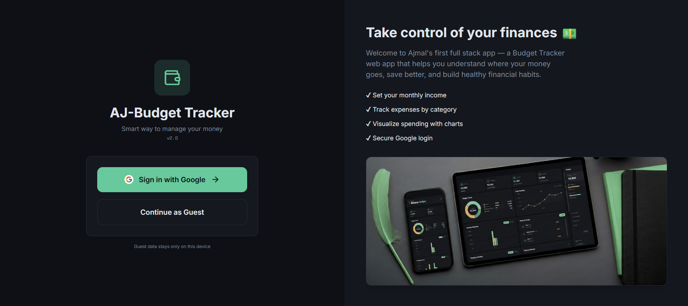
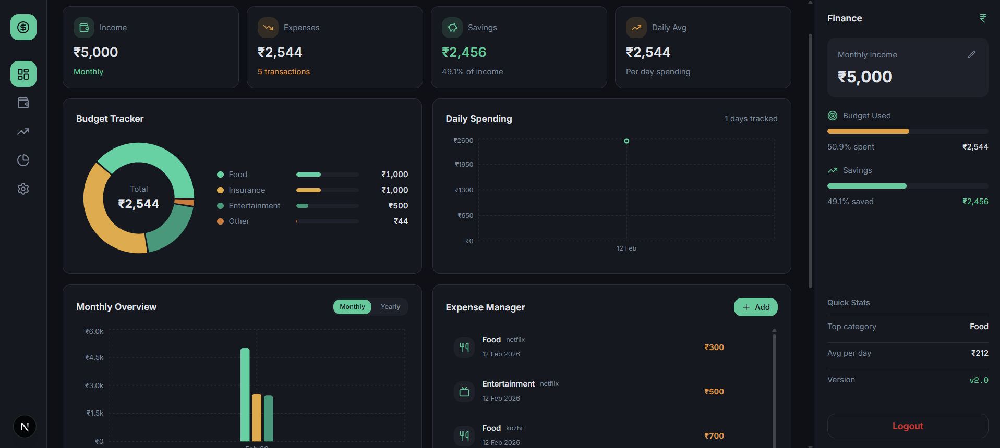
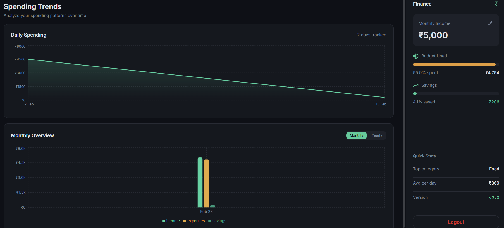
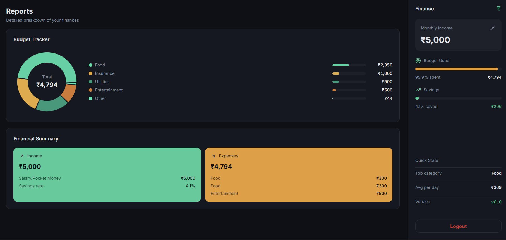

# 💰 Budget Tracker Web App

A modern **budget tracking web application** built with **Next.js**, **Supabase**, and **Google Authentication**.  
Track income, expenses, savings, and visualize your finances with interactive charts.

🔗 **Live Website:**  
👉 https://benevolent-naiad-d653e2.netlify.app

---

## ✨ Features

- 🔐 **Google Authentication** (Supabase Auth)
- 👤 **Guest Mode** (use app without login)
- 💵 **Income setup & onboarding flow**
- 🧾 **Add, edit & delete expenses**
- 📊 **Visual charts**
  - Monthly expenses
  - Daily spending
  - Savings overview
- 📱 **Responsive design** (desktop & mobile)
- ⚡ **Fast & smooth UX** with loading states
- ☁️ **Cloud-based data storage** (Supabase)

---

## 🛠️ Tech Stack

**Frontend**
- Next.js (App Router)
- React
- TypeScript
- Tailwind CSS

**Backend / Services**
- Supabase (Database + Auth)
- Google OAuth

**Deployment**
- Netlify
- pnpm
- Node.js 20

---

## 📸 Screenshots

### 🔐 Login Page

### 📊 Dashboard

### 📈 Charts

